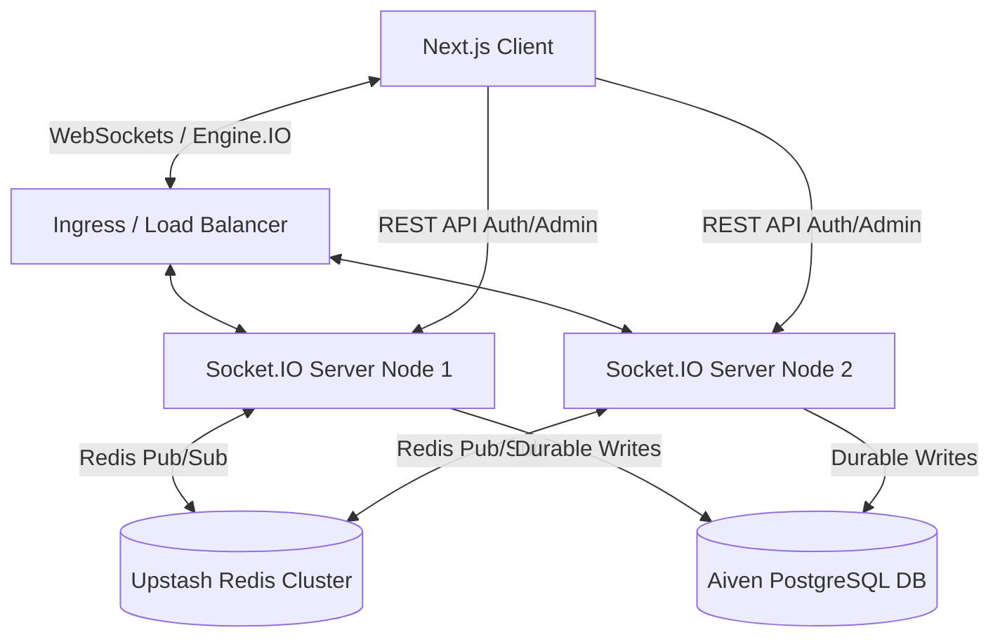

# StackChat - Distributed Real-Time Chat System

StackChat is a production-grade, horizontally scalable real-time chat application engineered to showcase advanced distributed systems competency, optimized database design, and resilient state recovery.

Unlike standard CRUD applications, this chat application handles stateful connections, ephemeral-vs-durable state partitioning, database write amplification mitigation, and cluster scale-out using zero-cost enterprise infrastructure.

---

## 🏗️ System Architecture & Design



### 1. Ephemeral vs. Durable State Separation
*   **Durable State (PostgreSQL)**: Users, conversation threads, participant memberships, and chat messages are written directly to PostgreSQL for permanent storage.
*   **Ephemeral State (Redis)**: User online/offline presence is registered in Redis using temporary keys with a **Time-To-Live (TTL)** of 15 seconds. Typing indicators (`typing:start` and `typing:stop`) bypass PostgreSQL entirely, broadcasting directly to rooms via Redis Pub/Sub, resulting in **zero database I/O overhead** for volatile actions.

### 2. Write Amplification Mitigation
Instead of updating an `is_read` boolean flag on every individual message row when a user views a thread (which results in $O(N)$ database updates for $N$ messages), this system uses a **Monotonic Cursor Strategy**:
*   A single cursor value (`last_read_seq` and `last_delivered_seq`) is tracked inside the `participants` junction table mapping users to conversations.
*   When a user opens a conversation, the client emits a read receipt updating their `last_read_seq` cursor to the highest known sequence ID.
*   Message read status is derived dynamically on the client by comparing a message's `sequence_id` against the recipient's cursor.
*   This drops database write load down to **exactly 1 write operation per conversation read session**.

### 3. Database Indexes Optimization
*   **Chronological Message Fetch Index**: To optimize query plans for fetching historical messages (`WHERE conversation_id = X ORDER BY created_at DESC`), we created a composite B-Tree index:
    ```sql
    CREATE INDEX idx_messages_conversation_created ON messages (conversation_id, created_at DESC);
    ```
    This structures the B-Tree leaf nodes by conversation grouping, enabling instant, ordered retrieval of chronological message page logs and preventing sequential heap scans on large datasets.
*   **Lexeme Search GIN Index**: To support full-text search without performance degradation, the database indexes messages using:
    ```sql
    CREATE INDEX idx_messages_body_search ON messages USING GIN (to_tsvector('english', body));
    ```

### 4. Connection Storm Protection
When a WebSocket server node reboots, thousands of clients reconnect simultaneously. Querying the database to authenticate these users would instantly lock the PostgreSQL connection pool.
*   StackChat solves this by verifying **stateless JSON Web Tokens (JWT)** on the CPU within the Socket.IO middleware handshake.
*   The token signature is verified cryptographically without hitting the database, keeping the data layer insulated from connection spikes.

### 5. API Rate-Limiting & Brute-Force Shielding
To prevent DDoS attacks and credential brute-forcing, a zero-dependency sliding-window IP rate limiter is implemented at the Express middleware layer. It tracks request timestamps in-memory, dynamically prunes stale entries, and restricts auth routes to 100 requests per 15 minutes.

### 6. Side-Channel Timing Attack Countermeasures
To prevent timing-attack user enumerations (where an attacker deduces whether a username exists based on how long the password verification takes), the system injects a dummy bcrypt check (`$2b$10$Z3VtbXloYXNoZm9ydGltaW5nYXR0YWNrcw==`) whenever a queried username is not found. This ensures consistent query response latency.

### 7. Graceful Shutdown & Resilient Bootstrapping
*   **Database Retry Loop**: Features connection retries with exponential backoff on database schema initializations to ensure startup stability.
*   **Resource Disposal**: Hooks into `SIGINT`/`SIGTERM` events to safely close the PostgreSQL client pool and Redis publisher/subscriber socket channels, preventing unreleased memory references and connection leaks.

---

## 🛠️ Technology Stack

*   **Frontend**: Next.js 16 (App Router, Javascript), Vanilla CSS layout styled after the premium visual guidelines (deep indigo `#4F46E5` primary theme, dark gray slate `#111827`, emerald `#10B981` presence indicator, Inter/Geist typography).
*   **Backend**: Node.js, Express, Socket.IO.
*   **Pub/Sub & Cache**: Upstash Redis (real-time message orchestration, typing indicators relay, and heartbeats).
*   **Data Store**: Aiven PostgreSQL (durable records, optimized indices).

---

## 🚀 How to Run Locally

### 1. Prerequisites
- Docker & Docker Compose
- Node.js (v18+)

### 2. Start PostgreSQL & Redis Services
From the project root directory, spin up the local containers:
```bash
docker-compose up -d
```
This runs:
*   PostgreSQL on port `5432` (user: `postgres`, password: `password`, db: `systemchat`)
*   Redis on port `6379`

### 3. Configure and Launch the Backend
Go into the backend folder, check environment variables in `.env`, and start the dev server:
```bash
cd backend
npm install
npm run dev
```
Upon startup, the server automatically runs the database schemas initialization script (`initDb`), compiles the tables, configures the indexes, and seeds default test users if the database is empty:
*   **Admin User**: Username: `admin` | Password: `admin123` (SysAdmin privileges)
*   **Standard Users**: Username: `sarah_chen` or `marcus_johnson` | Password: `password123`

### 4. Launch the Next.js Frontend
Go into the frontend folder and run the developer server:
```bash
cd frontend
npm install
npm run dev
```
Open [http://localhost:3000](http://localhost:3000) in your browser.

---

## 🌐 Live Deployments

*   **Live Frontend Application**: [https://stackchat-theta.vercel.app](https://stackchat-theta.vercel.app) (Hosted on Vercel)
*   **Live Backend API Server**: [https://stackchat-caiw.onrender.com](https://stackchat-caiw.onrender.com) (Hosted on Render)
*   **Keep-Alive Ping Endpoint**: [https://stackchat-caiw.onrender.com/ping](https://stackchat-caiw.onrender.com/ping) (Configure on UptimeRobot to prevent Render free-tier sleep cycles)

---

## 🌐 Production Deployment Outline

*   **Frontend Delivery**: Deploy the Next.js application to **Vercel** or **Cloudflare Pages** for global CDN delivery.
*   **Compute Node (WebSocket backend)**: Deploy the Node.js server container to **Render** always-on web services.
*   **Database**: Managed **Supabase PostgreSQL** (free tier connection pooler).
*   **In-Memory Backplane**: **Upstash Redis** (serverless Redis with native TCP connection support, free tier).
